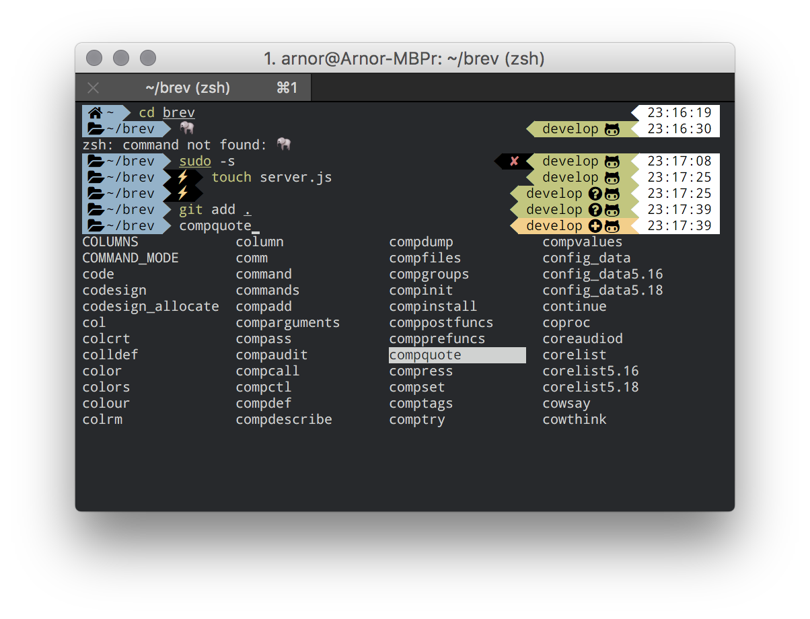

A short summary of my terminal setup. This is mostly just for my own future reference.



## iTerm settings

- Appearance 
  - Tabs
    - Theme: Dark 

- Profiles
  - Colors
    - Color Presets… -> Import -> [Japanesque](https://github.com/mbadolato/iTerm2-Color-Schemes/blob/master/schemes/Japanesque.itermcolors)

- Text
  - Cursor: Underline
  - Font: 10pt [Droid Sans Mono Awesome](https://github.com/gabrielelana/awesome-terminal-fonts/tree/patching-strategy/patched)
  - Use thin strokes for anti-aliased text: Always
  - Uncheck "Use a different font for non-ASCII text"

- Terminal
  - Report Terminal Type: `xterm-256color`

- Keys
  - `⌘ + Backspace`: Send Hex Codes: `0x15` _(Erase to start of line)_
  - `⌥ + Backspace`: Send Hex Codes `0x1b 0x88` _(Erase one word back)_
  - `⌘ + ←`: Send Hex Codes: `0x01` _(Cursor to start of line)_
  - `⌘ + →`: Send Hex Codes: `0x05` _(Cursor to end of line)_
  - `⌥ + ←`: Send Hex Codes: `0x1b 0x62` _(Cursor one word back)_
  - `⌥ + →`: Send Hex Codes: `0x1b 0x66` _(Cursor one word forward)_

- Advanced
  Use "smart truncation" for tab titles
  Terminal windows resize smoothly

## Zsh
Install [Oh My Zsh](http://ohmyz.sh/):
```sh
$ sh -c "$(curl -fsSL https://raw.github.com/robbyrussell/oh-my-zsh/master/tools/install.sh)"
```

Install [zsh-autosuggestions](https://github.com/zsh-users/zsh-autosuggestions):
```sh
$ git clone git://github.com/zsh-users/zsh-autosuggestions $ZSH_CUSTOM/plugins/zsh-autosuggestions
```

Install [Powerlevel 9K](https://github.com/bhilburn/powerlevel9k):
```sh
$ git clone https://github.com/bhilburn/powerlevel9k.git ~/.oh-my-zsh/custom/themes/powerlevel9k
```

Install [zsh-syntax-highlighting](https://github.com/zsh-users/zsh-syntax-highlighting/):
```sh
$ git clone https://github.com/zsh-users/zsh-syntax-highlighting.git ${ZSH_CUSTOM:-~/.oh-my-zsh/custom}/plugins/zsh-syntax-highlighting
```

Install [marker](https://github.com/pindexis/marker):
```sh
$ git clone https://github.com/pindexis/marker ~/.marker
$ ~/.marker/install.py
```

Other [really](https://github.com/posva/catimg), [really](https://en.wikipedia.org/wiki/Cowsay) [useful](https://github.com/passy/givegif) tools: 🐮
```sh
$ brew tap passy/givegif && brew install catimg cowsay givegif
```

Finally copy the [.zshrc](.zshrc)-file to the home dir.
